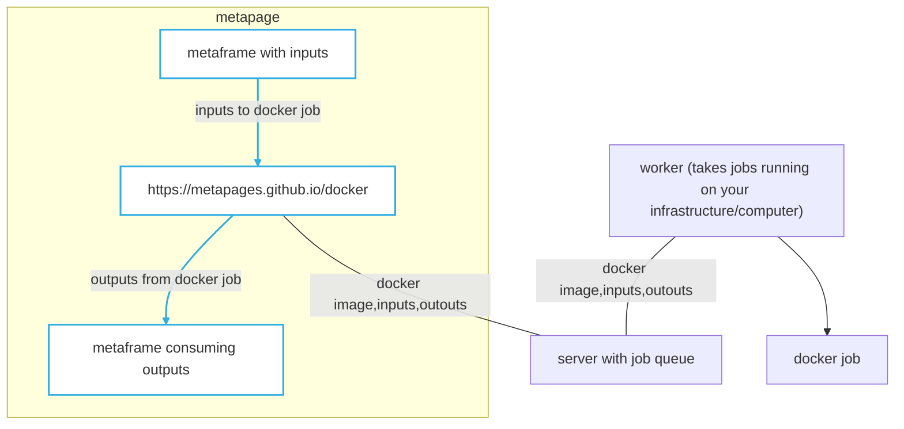

# Run docker containers via metapage in the browser

Run arbitrary docker containers at scale in your metapages.

Use cases:

 - machine learning pipelines
 - data analysis workflows

Versioned. Reproducible. No client install requirements, as long as you have at least one worker running somewhere, you can run any programming language.

## Getting started

TODO

## Example URL

Python 3:
https://docker-run.dev:8000/?command=cHJpbnQgXCggc2Rmc2RmMiBcKQ%3D%3D&image=python3#/queue/1?command=cHl0aG9uIC1jICdwcmludCgiaGVscCIpJw%3D%3D&image=python%3A3.8.8-alpine3.13
